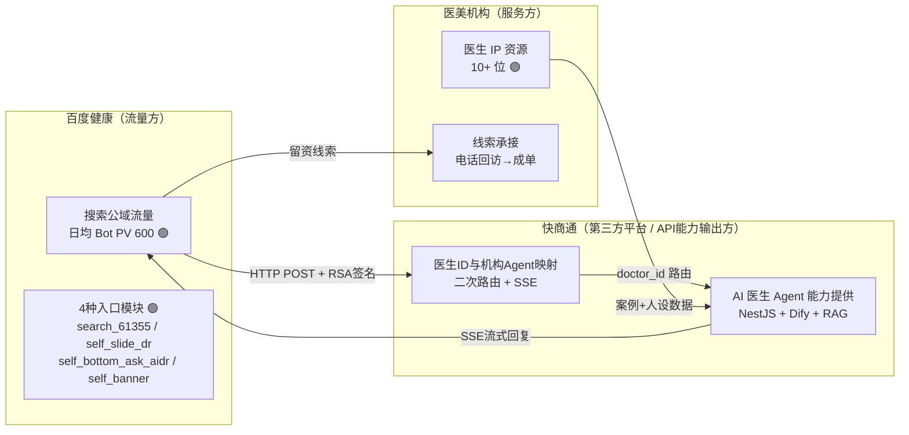
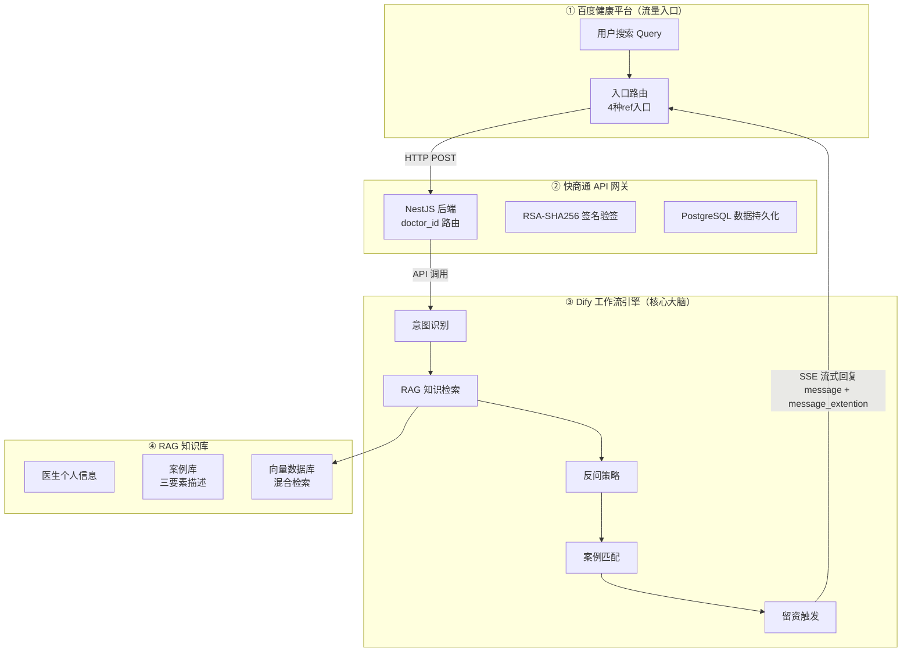
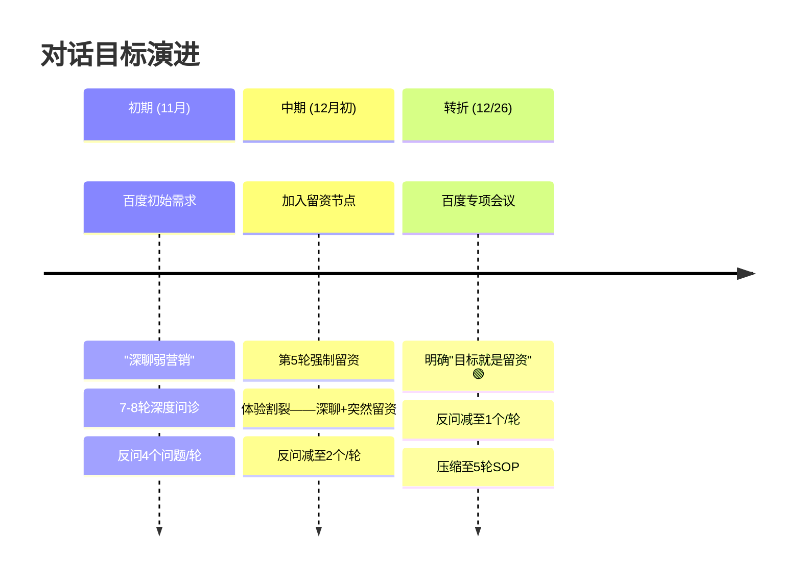
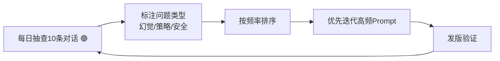

# 百度健康医生 IP Agent — 项目深度复盘报告

> **项目代号**: baidu-health-doctor-ip  
> **时间跨度**: 2025.11 – 2026.02  
> **角色**: AI 产品经理实习生（独立负责产品策略模块，协同研发/运营落地）  
> **证据强度图例**: 🟢 精确 | 🟡 推导 | 🟠 估算 | 🔴 推断

---

## 一、项目定位与商业模型

### 1.1 一句话定位

**医美专家 Agent 外部合作案例落地**——快商通作为第三方平台，向百度健康提供外接 AI 医生 Agent 能力的 **API 集成项目**，达成外部对话类型的 API 快速部署与**商业化线索变现模式**构建。🟢

> 本质是一个 **B2B 的 AI 能力输出项目**：快商通不直接服务终端用户，而是通过标准化 API 将 AI 医生 Agent 能力输出给百度健康平台，百度负责入口与流量承接，快商通负责医生 Agent 能力提供、医生 ID 与机构 Agent 的映射维护、对话请求的二次路由与返回。

### 1.2 三方合作模型



### 1.3 商业闭环与北极星指标

**北极星指标：留资率 (CVR)** = 留下电话的用户数 ÷ 进线总人数 🟢

> **商业化线索变现闭环**：快商通通过 API 向百度输出 Agent 能力 → Agent CVR 越高 → 百度分配更多免费搜索流量 → 机构获得更多线索 → 续约意愿增强 → 快商通 API 调用量 + SaaS 收入增长
>
> **对快商通的战略意义**：这是快商通从传统 SaaS 智能客服向 **对外 API 能力输出** 转型的标杆项目，验证了"AI Agent 能力 → 标准 API → 外部平台集成 → 线索变现"的商业化路径。

| 指标 | 定义 | 数据来源 |
|------|------|----------|
| 留资率 (CVR) | 留电话人数 / 进线总人数 | 百度健康后台 |
| 对话完成率 | 到达第5轮人数 / 进线总人数 | Dify 工作流日志 |
| 案例匹配准确率 | 正确匹配案例卡数 / 总弹出案例卡数 | 人工抽样评估 |
| 首字响应时间 | AI 回复第一个字的延迟（要求 <5s） | API 监控 |

---

## 二、业务背景与核心痛点

### 2.1 行业背景

- 2025 年中国医美市场规模超 **3000 亿元** 🟡
- 百度搜索是医美获客核心公域入口，竞品（新氧、美团医美）缺乏实时交互咨询能力
- 快商通是国内领先智能客服 SaaS 服务商，本项目是其 **首个外部对话类型 API 集成项目** 🟢——从传统 SaaS 产品向 **对外 API 能力输出 + 商业化线索变现** 模式转型的标杆案例

### 2.2 三大核心痛点

| 痛点 | 量化表现 | 强度 |
|------|----------|:----:|
| **人工客服成本高且能力有限** | 5-10名客服年成本约40-50万，约40%非工作时段流量完全流失 | 🟠 |
| **传统落地页转化率低** | 行业CVR仅3-5%，每个有效线索成本200-500元 | 🟡 |
| **医生个性化咨询难以规模化** | 头部医生面诊转化率20-30%，在线客服仅3-5%，差距4-6倍 | 🟠 |

### 2.3 三方需求天然冲突

| 方 | 核心诉求 | 冲突点 |
|----|----------|--------|
| 百度 | CVR 留资率 | 要快、要转化 |
| 机构 | "像真医生" | 要深、要专业 |
| 快商通 | 低维护成本可扩展 | 要简、要标准化 |

> 这个冲突在项目中反复出现，最终在 12/26 会议上通过数据说服达成"留资为核心目标"的共识。

---

## 三、技术架构与选型

### 3.1 系统四层架构



### 3.2 技术选型决策

| 对比维度 | Dify ✅ | LangChain | Coze |
|----------|---------|-----------|------|
| 可视化编排 | ✅ PM可直接调整 | ❌ 需写代码 | ✅ |
| 私有部署 | ✅ 数据不出境 | ✅ | ❌ 仅云端 |
| RAG 集成 | ✅ 原生支持 | ⚠️ 需自行集成 | ✅ |
| 医疗数据合规 | ✅ | ✅ | ❌ |

**选型理由**：百度对数据合规有严格要求（医生和患者案例不能出境），Dify 私有部署满足合规；可视化编排让 PM 直接调整策略，迭代速度提升约 **3-5 倍** 🟠。

### 3.3 API 接口演进

| 版本 | 日期 | 变更 | 核心能力 |
|------|------|------|----------|
| V1.0 | 2025.11.07 | 首次发布 | 纯文本对话 (message + message_end) |
| V1.1 | 2025.11.18 | 删除 conversion_end，新增 message_extention | 支持案例卡、留资卡等扩展组件 |

**SSE 事件类型** 🟢：`message`（流式文本）→ `message_extention`（案例卡/留资卡 JSON 一次性返回）→ `message_end`（结束信号）

### 3.4 前端技术栈 🟢

| 技术 | 版本 | 用途 |
|------|------|------|
| Vue | 3.2.13 | 前端框架 |
| Element Plus | 2.4.4 | UI 组件库 |
| localStorage | 浏览器原生 | 消息持久化 |
| fetch API | 原生 | SSE 流式调用 |

---

## 四、核心产品设计

### 4.1 对话策略——从"深聊"到"留资"的战略转变

#### 4.1.1 目标演进时间线



#### 4.1.2 12/26 转折会议——关键决策还原

> **背景**：百度侧产品经理发生更换 🟢，新PM对"深聊"需求理解与前任不同。我方在会前整理了对话漏斗数据——用户在第4-5轮流失率特别高。

**会议核心对话原文** 🟢：

> 发言人1（百度方）：*"我们其实还是以留资作为一个最终目的"*
> 
> 发言人2（快商通方 郑骁敏）：*"我们把目标就把对话的目标改成就是留资。目标就是留资。"*
> 
> 发言人2：*"之前收到的需求是要做深聊，如果是要做留资……话不应该像现在讲的这么多"*

**会议达成的 4 项决议** 🟢：
1. **案例卡匹配不准必须修复**——"案例卡是不能出错的，不然我们是没有办法上线的"
2. **反问改为单个问题**——"两个的话……他还得分辨你回答的是哪个问题"
3. **保留第 5 轮留资节点**——未留资则 3 轮后温和引导
4. **元旦前完成功能修复**——明确时间节点

#### 4.1.3 反问策略三版迭代 🟢

| 版本 | 反问数/轮 | 问题 | 改进动因 |
|------|:--------:|------|----------|
| V1 | 4个 | 信息量过大，用户不知道回哪个 | 百度方反馈"问题太多" |
| V2 | 2个 | 用户仍需分辨回答哪个 | 漏斗数据：3-4轮流失率陡增 |
| V3 ✅ | **1个** | 单问单答，精准收集 | 12/26会议共识 |

#### 4.1.4 最终 5 轮对话 SOP 🟢

| 轮次 | 节点 | 内容 | 触发条件 |
|:----:|------|------|----------|
| 1-3 | 反问 | 每轮1个精准问题，收集用户需求信息 | 自然对话 |
| 3-4 | 案例卡 | 推送匹配度最高的术前术后对比案例（最多1次） | RAG Score > 0.8 |
| 4 | 诊断小结 | 基于已确认信息生成个性化小结（不含未询问信息） | 强制触发 |
| 5 | 留资引导 | 留资卡 + 引导话术 | 强制触发 |
| 8+ | 二次引导 | 温和引导留资（如"给您开通一对一咨询服务"） | 仅在未留资时 |

### 4.2 RAG 知识库——数据治理驱动 AI 精度

#### 4.2.1 核心问题：案例卡匹配不准（P0 阻断）

**问题现象**：用户询问"黑眼圈"，AI 弹出"面部注射"的隆鼻案例。百度方明确表示这是上线的前置条件。

**根因分析**：
- 案例描述质量低——运营团队填写过于简略（如"双眼皮案例1"），缺乏痛点关键词
- 匹配逻辑基于整段对话内容而非聚焦当前主题
- 纯向量检索存在"语义漂移"（如"眼袋"与"卧蚕"混淆）

#### 4.2.2 解决方案（三管齐下）

**① 数据治理——案例描述三要素标准** 🟢

每条案例必须包含：
1. **用户痛点关键词**（如"黑眼圈"、"眼袋"、"泪沟"）
2. **手术方案名称**（如"光子嫩肤"、"玻尿酸填充"）
3. **术后效果描述**（如"暗沉改善90%"、"泪沟填平自然"）

配套 **17 项审核 Checklist**，数据入库前必须通过质量审核。

**② 混合检索 (Hybrid Search)** 🟢

```
Score = α × Vector_Score + (1-α) × Keyword_Score
```

解决专业术语的语义漂移问题，同时利用向量语义匹配和关键词精确匹配。

**③ 兜底逻辑** 🟢

设置相似度阈值（Score > 0.8），无高匹配案例时**绝对不弹**，防止误导。单次对话最多弹出 1 次案例卡，用户主动要求时可再弹。

#### 4.2.3 效果

| 指标 | 优化前 | 优化后 | 强度 |
|------|--------|--------|:----:|
| 案例匹配准确率 | 约60%-70% | 约85%-90% | 🟠 |
| "问A弹B"类错误率 | 约30%-40% | <10% | 🟠 |

> **口径**：正确匹配案例卡数 / 总弹出案例卡数。样本为 5 轮系统性评测约 100 条 case（2025-11-17 至 2025-12-01）。

### 4.3 医生人设系统

通过 System Prompt 注入医生个性化内容：
- **性格描述**（如"温柔知性"、"严谨学术"）
- **定制开场白**（含医院、职称、擅长项目）
- **科室统一工作流**：同科室医生共用对话逻辑，通过 `doctor_id` 传参区分个性化内容

### 4.4 关键设计决策

| 决策点 | 可选方案 | 最终选择 | 决策理由 |
|--------|---------|----------|----------|
| 工作流管理 | A: 每医生独立 / B: 按科室统一 | **B** | 10+医生仅维护2个工作流，成本降约80% 🟠 |
| 对话目标 | A: 深聊(7-8轮) / B: 留资(5轮) | **B** | 12/26会议数据驱动达成共识 🟢 |
| 案例卡频次 | A: 每2-3轮弹 / B: 最多弹1次 | **B** | 百度反馈频繁弹卡干扰体验 🟢 |
| 反问数量 | A: 4个→2个→1个 | **1个** | 用户理解成本+漏斗流失数据 🟢 |

---

## 五、质量保障体系

### 5.1 五轮系统性评测 🟢

| 轮次 | 日期 | 样本 | 核心发现 | 问题层级 |
|:----:|------|:----:|----------|----------|
| 1 | 11/17 | 5条 | 首轮未出反问、响应时间长(7-10s)、小结信息不合理 | 基础质量 |
| 2 | 11/24 | 20条 | 多条未出留资卡但出了留资话术、照片功能缺失 | 功能完整性 |
| 3 | 11/26 | 20条 | 4条响应失败、2条连问3-4个问题、重复问联系方式 | 能力边界 |
| 4 | 11/27 | 20条 | 4条响应失败、前端显示异常、缺少选项引导 | 功能稳定性 |
| 5 | 12/01 | 20条 | 5条响应失败、**私密整形query未拒答**(P0安全问题) | **内容安全** |

> **递进特征**：每轮暴露更深层问题——从基础显示到功能逻辑到能力边界到最终安全红线。

### 5.2 Bad Case 驱动迭代闭环



**分类体系**：
- **幻觉类**（模型杜撰信息、小结出现未询问内容）
- **策略类**（反问过多、案例卡重复弹出、留资引导不足）
- **安全类**（私密整形未拒答、涉及诊断性结论）

### 5.3 产品验收 (12/22) 🟢

6 个标准 Case 覆盖核心场景：

| Case | 测试维度 | 结果 | 发现的问题 |
|:----:|----------|:----:|------------|
| 1 | 医生开场+反问(≈3轮) | ✅ | — |
| 2 | 小结表达 | ✅ | — |
| 3 | **留资卡触发** | ⚠️ | 多轮对话没有重复弹出留资卡；留资引导不够 |
| 4 | **案例卡补充** | ⚠️ | 没有延时触发；案例效果不明显；只匹配单一案例 |
| 5 | 无关问题处理 | ✅ | — |
| 6 | **多轮对话** | ⚠️ | 重复弹出同一案例卡；留资引导不足 |

---

## 六、生产事故与复盘

### 6.1 事故总览

| 事故 | 日期 | 持续时长 | 严重度 | 根因 |
|------|------|:--------:|:------:|------|
| API Connection Closed | 12/17 | 1.5h 🟢 | P0 | `user`参数改必填，百度方未传 |
| API 500 错误 | 12/18 | 37min 🟢 | P0 | 服务器被攻击/平台不稳定 |
| 对话续接失败 | 12/23-24 | ~24h 🟢 | P0 | `trace_id`误作对话唯一标识 |

### 6.2 关键事故详解

#### 事故1：12/17 Connection Closed（缺失测试环境的代价）

**时间线** 🟢：
- 20:26 百度方 FlyNiu 反馈"请求 Connection Closed"
- 排查确认：当天下午开发为新医生上线将 `user` 参数改为必填
- 但百度方从未传递该参数（接口文档标注为"可选"）
- 21:57 回滚代码恢复服务

**根本原因**：**没有测试环境**，代码变更直接怼生产。

**推动的改进**：
- 在项目看板将"测试环境缺失"列为 P0 风险项
- 推动运维搭建独立预生产环境（前端 9982 端口 + 后端预生产 K8S）
- 此后再未发生同类事故

#### 事故3：12/23-24 对话续接失败（接口语义理解不充分）

**时间线** 🟢：
- 12/23 21:47 百度方反馈所有医生多轮对话异常
- 排查发现开发使用 `X-Trace-Id` 作为对话唯一标识
- 但百度每次 HTTP 请求的 `trace_id` 不同（非固定值）
- 12/24 与百度技术侧 FlyNiu 确认 `trace_id` 实际行为
- 改用统一账户名称方案管理对话唯一性
- 12/24 22:17 修复完成

**教训**：对接外部 API 时，不能只看文档规范，必须实际联调验证每个字段的真实行为。

---

## 七、协作与沟通

### 7.1 团队结构

```
郑骁敏（产品负责人/项目经理）
    └── 我（AI PM 实习生）
         ├── 协作：黄友福（后端）、刘思芃（前端）
         ├── 协作：陈佳裕、李晨欢（Dify 工作流/Prompt）
         ├── 协作：陈宏彬（业务）、客户管家团队
         └── 外部：百度（不吃🥑-产品、FlyNiu-技术、肉肉-运营）
```

### 7.2 角色边界

| 工作内容 | 我做的 | 团队做的 |
|----------|--------|---------|
| 对话策略设计 | 设计反问策略、留资机制、案例卡规则 | 陈佳裕在Dify中落地 |
| Prompt 设计 | 设计医生人设+反问逻辑Prompt，Bad Case迭代 | 陈佳裕配合更新 |
| 知识库标准 | 制定三要素+Checklist，推动运营重写案例 | 运营团队执行采集 |
| 百度侧对接 | 参与需求对接、功能验收、策略会议 | 郑骁敏主导整体关系 |
| Bad Case分析 | 每日抽查10条，标注→分类→排序→迭代 | 运营配合标注 |
| 医生上线SOP | 编写8步标准化流程 | 业务团队执行收集 |
| 产品文档 | 独立撰写项目全景图、运营手册等全套 | — |

### 7.3 关键沟通挑战

| 挑战 | 表现 | 我的应对 |
|------|------|----------|
| 测试环境缺失 | 代码直推生产导致3次事故 | 列为P0风险项持续推动 |
| 工作流管理混乱 | 多个app key，前后端不对齐 | 推动按科室统一工作流 |
| 百度PM更换 | 深聊→留资需求漂移 | 用漏斗数据推动共识 |
| 深夜协作常态 | 多次凌晨处理事故 | 建立变更通知机制 |

---

## 八、量化成果

### 8.1 核心指标

| 指标 | 优化前 | 优化后 | 变化 | 强度 |
|------|--------|--------|------|:----:|
| 医生上线数量 | 首批4位 | 累计10+位(医美+植发) | 150%+增长 | 🟢 |
| 案例匹配准确率 | 约60-70% | 约85-90% | ↑约20-25% | 🟠 |
| 对话完成率 | 约25-30% | 约40-50% | ↑约15-20% | 🟠 |
| 首字响应时间 | 偶发>5s | 稳定<5s | 达标 | 🟡 |
| 新医生上线周期 | 约5-7天 | 约2-3天 | 缩短60% | 🟠 |

### 8.2 商业价值

| 技术语言 | 商业语言 | 强度 |
|----------|----------|:----:|
| 10+位医生上线 | 7×24h在线咨询，"永不下班的专属助理" | 🟢 |
| 案例匹配85-90% | 精准案例驱动用户信任→直接驱动留资转化 | 🟠 |
| AI替代人工客服 | **年省约80-100万元**（10位医生×8-10万/人） | 🟠 |
| 百度放量 | CVR达标→更多免费流量→正向飞轮 | 🟢 |

> **客户 ROI**：单家机构接入3位医生，AI月费约5千-1万，替代3名客服月成本2-2.5万，ROI约 **2.5-5:1** 🟠

### 8.3 上线医生清单 🟢

| 批次 | 医生 | 机构 | 科室 |
|:----:|------|------|:----:|
| 一 | 蒋铮铮 | 杭州浮想国 | 医美 |
| 一 | 李花停 | 上海薇琳 | 医美 |
| 一 | 牛克辉 | 深圳艺星 | 医美 |
| 一 | 林华芬 | 上海薇琳 | 医美 |
| 二 | 叶宇 | 北京美莱 | 医美 |
| 二 | 宋萍 | 云南华美美莱 | 医美 |
| 二 | 王阳 | 雍禾植发 | 植发 |
| 二 | 徐鲁 | 雍禾植发 | 植发 |
| 二 | 杨荣华 | 上海薇琳 | 医美 |
| 二 | 张怀军 | 上海薇琳 | 医美 |

---

## 九、方法论总结

| 方法论 | 应用场景 | 具体操作 | 效果 | 可迁移到 |
|--------|---------|----------|------|----------|
| Bad Case 驱动迭代 | 对话质量优化 | 每日10条抽样→分类(幻觉/策略/安全)→排序→迭代Prompt | 准确率60-70%→85-90% | 所有LLM/Agent产品 |
| 数据质量前置治理 | RAG知识库 | 三要素标准+17项Checklist→入库前审核 | 从源头解决"回答不准" | 任何RAG产品 |
| 产品策略AB验证 | 对话策略选择 | 深聊 vs 留资漏斗数据对比 | 明确核心目标 | 需在体验和目标间取舍的决策 |
| SOP标准化运营 | 医生上线流程 | 8步SOP(采集→审核→配置→测试→上线) | 上线周期5-7天→2-3天 | B端批量上线场景 |

---

## 十、个人成长总结

> 从「只关注 AI 能不能用」到「关注 AI 产品的全链路价值闭环」的转变。
> 
> **三个核心认知**：
> 1. AI 产品的核心壁垒不在模型本身，而在于**如何将非结构化的行业知识变成结构化的 AI 知识库**——Garbage In, Garbage Out
> 2. **快速迭代不能以牺牲工程规范为代价**——没有测试环境就不要动生产
> 3. 多方协作中，产品经理需要**用数据说话**来推动共识，尤其是当各方需求冲突时
