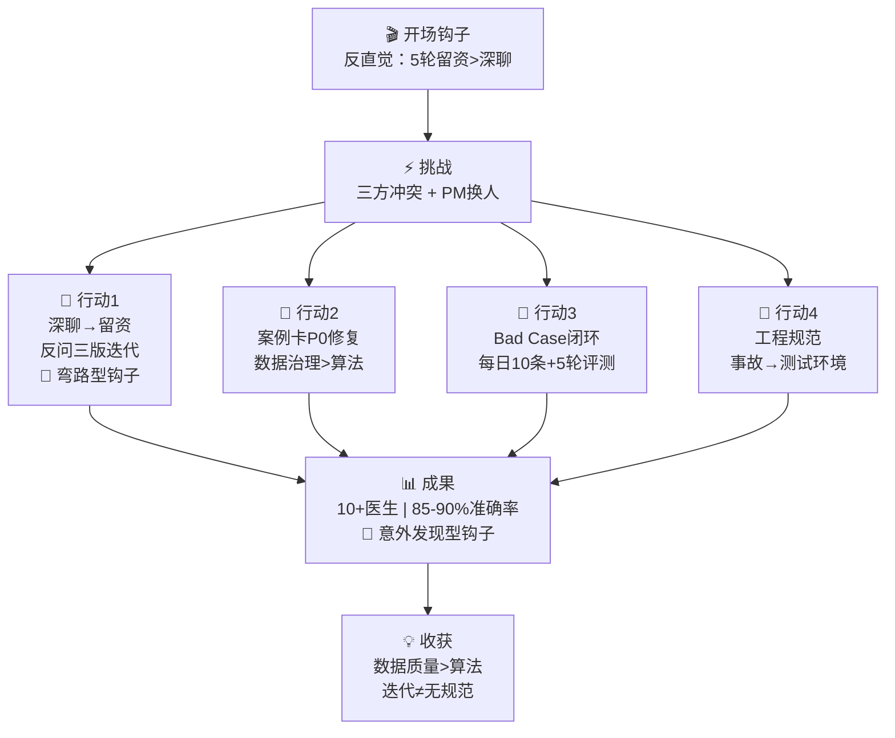

# 百度健康医生 IP Agent — 面试故事线地图 (Story Map)

> **阅读指引**：面试前 10 分钟速览此文件，依据面试官追问方向灵活跳转到对应"故事支线"。

---

## 🎯 核心叙事主线

```
反直觉开场 → 商业背景(20s) → 三方冲突+PM换人(30s) → 四大行动(60s) → 成果(20s) → 收获(20s)
```

**一句话钩子**：`"核心挑战不是让 AI 聊得更像医生，而是让 AI 在 5 轮对话内就完成留资。"`

---

## 📍 故事节点总览



---

## 🎣 三大钩子部署点

| # | 类型 | 钩子语句 | 部署位置 | 触发面试官什么反应 |
|---|------|---------|---------|-------------------|
| ❶ | **反直觉** | "核心挑战不是让AI像医生，而是5轮内留资" | 开场第一句 | "为什么？"→引出深聊vs留资 |
| ❷ | **弯路型** | "这其实是第三版方案——前两版都失败了" | 行动1过渡句 | "前两版怎么失败的？"→引出迭代过程 |
| ❸ | **意外发现** | "对话完成率提升超预期——15-20%" | 成果部分 | "为什么超预期？"→引出漏斗分析 |

---

## 📎 故事支线库（按面试官追问方向调用）

### 支线 A：策略深度线 — "你的产品sense"

**触发信号**："你是怎么决定的？" / "你怎么判断的？"

**故事弧**：
1. 百度初始需求是"深聊弱营销"→ 我们照做 → 事实证明用户第3-4轮流失严重
2. 数据驱动洞察：搜索场景用户耐心有限，不是线下面诊心态
3. 12/26会议用漏斗数据推动共识 → 百度方亲口确认"目标就是留资" 🟢
4. 反问策略三版迭代(4→2→1) → 5轮SOP → 效果验证

**金句**："不是我拍板或老板拍板，是数据说服了大家。"

---

### 支线 B：技术理解线 — "你懂不懂技术？"

**触发信号**："你了解RAG吗？" / "架构怎么设计的？"

**故事弧**：
1. 四层架构(百度流量入口→API网关→Dify工作流→RAG知识库)
2. SSE流式回复 + message_extention传卡片
3. 案例匹配问题：数据治理(三要素) > 算法调参
4. conversation_id踩坑：trace_id不是固定值

**金句**："根本不是检索算法的问题，而是数据太烂。Garbage In, Garbage Out。"

---

### 支线 C：执行力线 — "你真的做了吗？"

**触发信号**："你的角色具体是什么？" / "你做了什么？"

**故事弧**：
1. 我主导策略模块，老板主导整体关系
2. 4件具体产出：5轮SOP + 三要素标准+Checklist + Bad Case闭环 + 全套文档
3. 5轮评测(约100条case具名记录) + 产品验收(6个Case) → 可追溯
4. 推动测试环境 + 推动工作流迁移

**金句**："不是一次性优化，而是持续跑的机制。"

---

### 支线 D：踩坑复盘线 — "你犯过什么错？"

**触发信号**："有什么教训？" / "出过什么问题？"

**故事弧**：
1. 12/17事故(1.5小时全量中断) → 没有测试环境的代价 🟢
2. 12/23事故(24小时对话中断) → 不能只看文档要实际联调 🟢
3. 事后推动：P0风险项→测试环境搭建→变更通知机制
4. 收获：宁可慢两天上线，也不能没有测试环境

**金句**："一次事故就证明了，快速迭代不能以牺牲工程规范为代价。"

---

### 支线 E：商业价值线 — "这个项目的商业价值是什么？"

**触发信号**："这个项目赚钱吗？" / "对公司有什么价值？"

**故事弧**：
1. 本质是快商通首个外部对话类型API集成项目——通过标准化API向百度输出Agent能力
2. 商业化线索变现闭环：API能力输出→CVR达标→百度分配更多免费流量→机构更多线索→续约增长
3. 替代人工客服年省80-100万 🟠（含推算逻辑）
4. 客户ROI约2.5-5:1 🟠
5. 标杆效应：从传统SaaS智能客服向**对外API能力输出**转型的商业化路径验证

**金句**："不是省几个客服的事，而是验证了一个AI Agent能力通过标准API输出到外部平台的商业化路径。"

---

## 🔀 中断恢复表

| 如果面试官打断问... | 你应该... |
|---------------------|----------|
| "停一下，CVR到底多少？" | 坦诚说百度后台数据没有权限 → 转引间接证据(完成率+放量行为) |
| "你说的数据，有没有系统记录？" | 区分🟢精确值(有文档/时间戳)和🟠估算值(人工抽样) |
| "你老板怎么看？" | 强调协作关系"她主导整体，我主导策略+质量" |
| "百度为什么信你？" | 呈现12/26会议用数据推动共识的经历 |
| "只做了3个月?" | 强调0→1+快速迭代节奏(5轮评测/3次事故/10+医生上线) |
| "这个项目还在运行吗？" | 确认仍在运行，百度持续放量 |

---

## ⏱️ 时间把控

| 段落 | 目标时长 | 关键词 | 如果只有30秒 |
|------|:-------:|--------|-------------|
| 开场+钩子 | 20s | "5轮留资" | ✅ 必说 |
| 挑战 | 30s | "三方冲突+PM换人" | ✅ 必说 |
| 行动1(策略) | 20s | "第三版方案" | ✅ 必说 |
| 行动2(数据) | 15s | "三要素+兜底" | ✅ 必说 |
| 行动3(质量) | 10s | "Bad Case" | ⚡ 简述 |
| 行动4(工程) | 10s | "测试环境" | ⚡ 简述 |
| 成果 | 15s | "10+医生, 85-90%" | ✅ 必说 |
| 收获 | 10s | "数据>算法" | ⚡ 简述 |
