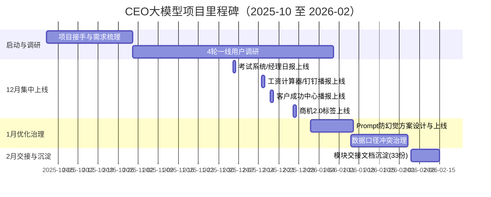
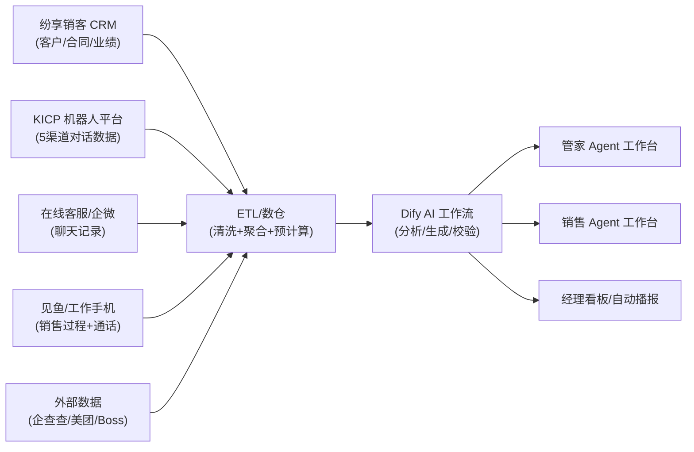
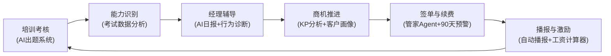
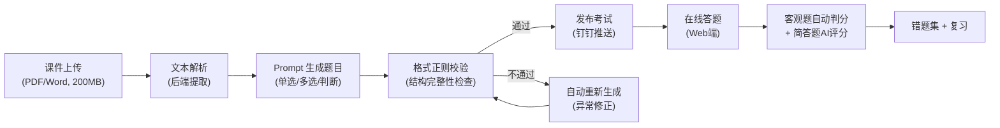
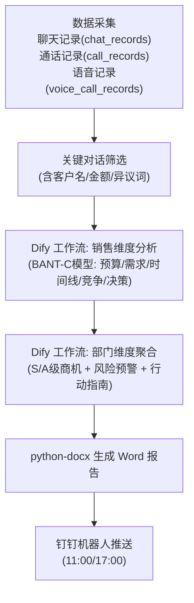
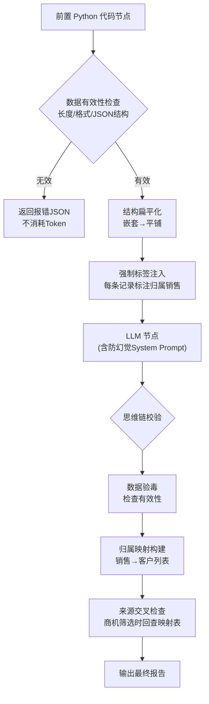
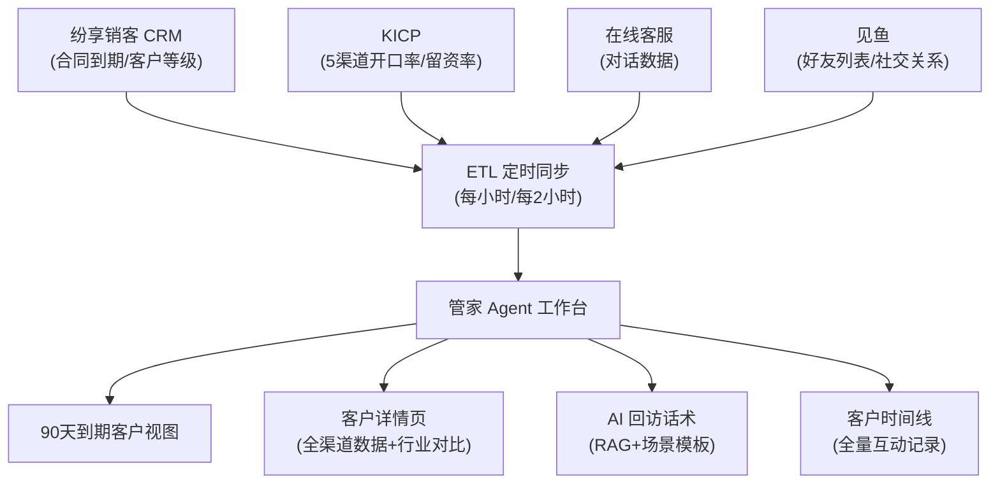

# 02 项目全景档案（CEO大模型）

## 1. 项目定性与背景

### 1.1 项目定性

| 字段 | 内容 |
|------|------|
| 项目名称 | CEO 大模型 — AI 销售效能平台 |
| 所属公司 | 快商通（厦门智能客服头部企业，SaaS 赛道） |
| 项目类型 | **To B 内部 CRM 型 AI 平台** → 后续规划转型为 **SaaS 平台对外出售** |
| 项目时间 | 2025.10 - 2026.02 |
| 你的角色 | AI 产品经理（接手后独立负责多模块全流程：需求调研 → PRD → 方案取舍 → 开发跟进 → 上线验收 → 效果复盘） |
| 团队规模 | 约 8 人（1 产品经理 + 3 后端研发 + 1 前端研发 + 1 算法工程师 + 1 数仓工程师 + 1 业务方） |
| 项目状态 | **已上线运营，持续迭代中**，覆盖全公司约 50+ 名销售和管家日常使用 |
| 一句话定位 | 基于 **Agent 架构**的 AI 销售效能平台，连接 5 大数据源，通过 **管家 Agent + 销售 Agent** 双 Agent 和 8+ 模块，解决「培训考核效率低、管理监控滞后、客户运营粗放、激励反馈不透明」四大核心痛点 |

### 1.2 行业与竞品背景

快商通所在的 SaaS 智能客服行业正经历 AI 大模型驱动的转型。传统 CRM/客服系统面临三个局限：① 无法理解非结构化沟通内容；② 缺乏主动式客户运营能力；③ 培训管理依赖人工经验。

竞品格局：微盛 AI·企微管家（企微深度整合但高价）、纷享销客 ShareAI（RAG 实施周期长）、销售易 NeoAI（额外付费）、听脑 AI/Gong（本土适配弱）。**快商通差异化**：依托自身客服 SaaS 生态和完整业务数据链路（CRM + 企微 + 见鱼 + KICP），以更低成本落地 AI Agent，形成「自用验证 + 外售」双轮模式。

来源: 2026-02-13 | CEO大模型_项目总览.md | L7-L14,L26-L34

### 1.3 时间线（可核验）

来源: 2026-01-05 | CEO大模型项目分析报告.md | L187-L194  
来源: 2026-01-05 | 月度复盘/12月复盘-CEO大模型.md | L19-L26

## 2. AI PM 能力矩阵与功能映射

### 2.1 核心能力 × 模块矩阵

| AI PM 能力维度 | 对应模块 | 核心方案 | 关键 AI 技术 | 指标/状态 |
|---|---|---|---|---|
| **Agent 架构设计** | 管家 Agent | 90天到期管理 + 客户画像 + AI 回访 | Agent + 多源数据聚合 | 已上线，查数 ~94% 提效 |
| **Agent 架构设计** | 销售 Agent | 考试 + 日报 + 工资 + 商机 KP 分析 | Agent + Dify 工作流 | 已上线，8+ 模块覆盖 |
| **Dify 工作流编排** | AI 出题系统 | 课件→生成→校验→修正→发布→判分 | Dify 工作流 + Prompt | 4h→10min（95.8%） |
| **Dify 工作流编排** | 经理日报 | 关键对话筛选→BANT-C分析→部门报告→推送 | Dify 工作流 + 定时任务 | 2h→30min（83.3%） |
| **Dify 工作流编排** | KP 维度分析 | 多源记录聚合→时间轴排序→商机推进分析 | Dify 工作流 | 已上线 |
| **Prompt Engineering** | 日报防幻觉 | 熔断协议 + 溯源锚定 + 思维链校验 | Prompt 设计 + 前置代码节点 | 已落地优化方案 |
| **RAG 知识库** | AI 回访话术 | RAG + 6大场景模板→个性化话术 | RAG + Prompt | 6 大场景已上线 |
| **多源数据治理** | ETL 聚合 | 5源→数仓→Agent工作台 | ETL + APScheduler | 15+ 定时任务 |
| **数据产品** | 口径治理 | 去重规则显式化 + 口径前置到PRD | 数据治理方法论 | 已形成规范 |
| **数据产品** | 自动播报 | 多时段 APScheduler→钉钉推送 | 定时任务 + 数据看板 | 0 耗时（100% 自动化） |
| **数据产品** | 工资计算器 | 底薪档位 + 阶梯提成实时计算 | 规则引擎 | 30min→秒级（99%+） |

### 2.2 数据链与业务链

#### 数据链（系统链路）

#### 业务价值闭环

来源: 2026-02-13 | CEO大模型_项目总览.md | L69-L79

## 3. PRD/文档资产全量清单

> 共 33 项，体现 AI PM 的产出密度和文档体系化能力。

| 序号 | 文档路径 | 类型 | AI PM 能力标签 |
|---:|---|---|---|
| 1 | `管家agent/管家部agent 需求.md`（15,911字） | PRD | Agent 架构 |
| 2 | `管家agent/管家部agent需求—AI回访+话术.md`（11,269字） | PRD | RAG + Prompt |
| 3 | `管家agent/管家详情页功能prd------KICP 取数逻辑.md` | PRD | 数据治理 |
| 4 | `管家agent/管家详情页功能prd-----在线客服系统取数逻辑.md` | PRD | 数据治理 |
| 5 | `管家agent/客户时间线管理功能PRD（V1.0）.md` | PRD | Agent 架构 |
| 6 | `管家agent/客户时间线管理功能PRD（V2.0）.md` | PRD | Agent 架构 |
| 7 | `管家agent/90天新客户页面功能prd文档.md` | PRD | Agent 架构 |
| 8 | `培训考试系统/销售自动考试系统PRD文档.md` | PRD | Dify 工作流 |
| 9 | `销售agent/经理日报2.0prd.md` | PRD | Dify 工作流 |
| 10 | `销售agent/商机2.0板块prd.md` | PRD | 数据产品 |
| 11 | `销售agent/销售工资计算器prd文档.md` | PRD | 数据产品 |
| 12 | `销售agent/工资计算器2.0.md` | PRD | 数据产品 |
| 13 | `自动播报机器人/销售提醒机器人prd文档.md` | PRD | 定时任务 |
| 14 | `自动播报机器人/质检播报机器人prd2.0.md` | PRD | 定时任务 |
| 15 | `自动播报机器人/质检工作手机数据播报机器人PRD文档.md` | PRD | 定时任务 |
| 16-20 | 交接文档 ×5（管家AI/销售AI/播报/考试/baidu-ai-demo） | 交接 | 知识管理 |
| 21-33 | 会议记录/调研报告/竞品分析/复盘等 13 份 | 其他 | 方法论 |

来源: 2026-02-19 | _analysis_output/latest/_meta/prd_inventory.csv

## 4. 关键技术方案详解

### 4.1 AI 出题工作流（Dify）

- **为什么选 Dify 而非直连 API**：直连 API 出题格式错误率 15%-20%（用 A/B/C/D、1/2/3/4、缺少换行等变体），无法稳定解析。Dify 将出题逻辑编排为标准化工作流，可编排、可校验、可重试、可观测。
- **API Key**：对话分析 `app-MEfWchV8GW4yESwRoBVQBvD6`，日报生成 `app-HsFKzncFgBIzDp02Xcdd2sNB`，KP 分析 `app-HLTJZlafmwEPSlMZffuy4HUd`

来源: 2026-02-13 | CEO大模型_项目总览.md | L83-L87  
来源: 2026-02-05 | 销售相关文档/销售agent-商机+日报+聊天分析交接文档.md | L568-L576

### 4.2 经理日报 AI 分析链路

**AI 分析输出字段**：客户分级（高/中/低）、BANT-C 分析、公司规模、预算情况、需求紧迫性、决策流程、竞争分析、风险评估、分级理由、下一步行动、行动依据

来源: 2026-02-05 | 销售相关文档/销售agent-商机+日报+聊天分析交接文档.md | L227-L265

### 4.3 Prompt 防幻觉架构

来源: 2026-01-29 | 工作流/优化方案_Fix_Manager_Issues.md | L1-L165

### 4.4 管家 Agent 数据聚合架构

来源: 2026-02-13 | CEO大模型_项目总览.md | L89-L93

## 5. 数据表与定时任务体系

### 5.1 核心数据表（8 张）

| 数据表 | 核心字段 | 数据来源 | AI 分析字段 |
|---|---|---|---|
| employee | name, department, wechatid | SCRM API | — |
| call_records | employee, customer, duration, recording_url | SCRM API + ASR | ai_summary, ai_keywords, dialog_analysis, deep_talk |
| chat_records | employee, customer, todaychatnums, chats | SCRM API | ai_summary, ai_keywords, dialog_analysis, deep_talk |
| opportunity_data | name, amount, sales_stage, owner, products | 纷享销客 API | kp_analysis, customer_info, records_ids |
| customer_info | accountWxId, friendWxId, wxAlias, phone | 见鱼 API | — |
| chat_analysis | employee, customer, summary, bantc, level, stage | Dify 工作流 | 全部字段均为 AI 分析输出 |
| chat_dept_analysis | department, high/mid_level_customer, risk, action_guide | Dify 工作流 | 全部字段均为 AI 分析输出 |
| voice_call_records | employee, customer, duration, recording | 见鱼 API + ASR | ai_summary, dialog_analysis |

### 5.2 定时任务编排（15+）

| 频率 | 任务 | 功能 |
|---|---|---|
| 每小时 | 见鱼好友同步 + 纷享商机同步 | 数据底座更新 |
| 每 2 小时 | 客户信息匹配 + 行业字段同步 + 最新联系时间更新 | 数据关联增强 |
| 每 30-55 分钟 | 电话/微信/语音记录获取 + AI 分析 | 实时数据采集 |
| 每 40 分钟 | 录音 AI 分析（ASR → Dify） | AI 内容分析 |
| 11:00/17:00 | 经理日报生成 + 商机 KP 分析 | 核心业务产出 |
| 10:10/16:10 | 微信聊天获取 + AI 分析 | 沟通数据采集 |
| 12:00/1:30 | 批量更新客户信息 | 数据一致性 |

来源: 2026-02-05 | 销售相关文档/销售agent-商机+日报+聊天分析交接文档.md | L439-L457

## 6. 决策复盘表（含备选方案与 AI PM 视角）

| 决策主题 | 方案 A | 方案 B（最终） | AI PM 决策理由 | 风险/代价 | 证据 |
|---|---|---|---|---|---|
| AI 出题引擎 | 直连大模型 API（快但不可控） | Dify 工作流（生成→校验→修正） | **AI 产品需要可编排、可校验、可重试的工作流**，不能依赖单次 API 调用的随机稳定性 | 搭建成本高 | C013 |
| 管家数据聚合 | 实时拉多系统 API | 定时 ETL 入数仓 | **跨系统关联分析需求 > 实时性需求**，T+1 可接受但查询速度和一致性不可妥协 | 存在时效延迟 | C014 |
| 日报分析策略 | 全量聊天分析 | 关键对话筛选后分析 | **AI 产品需平衡成本与质量**：筛选减少无关噪音，准确率反而提升，月成本降 80% | 可能遗漏边缘信号 | C015 |
| 日报幻觉治理 | 换更强模型 | Prompt 熔断 + 溯源锚定 + 代码前置 | **Prompt Engineering 是 AI 产品可控性的核心手段**，模型升级不能替代流程兜底 | 方案复杂度高 | C025,C026 |

## 7. 事故复盘表

| 事故 | 现象 | 根因（AI PM 视角） | 处置动作 | 学到的方法论 |
|---|---|---|---|---|
| 渠道数据口径冲突 | 百度渠道指标偏高 | 多源数据缺乏统一口径定义 → **数据产品必须"先定义口径再展示数据"** | PRD 口径前置 + 展示层口径说明 + 跨渠道比对 | 多源数据治理方法论 |
| AI 出题格式错误 | 15%-20% 题目结构异常 | 单次 API 调用缺乏后处理 → **AI 生成内容必须设计「生成→校验→修正」链路** | 重构为 Dify 三步工作流 | AI 内容质量保障链路 |
| 经理日报幻觉+错配 | 无效输入产出报告/客户归属错 | 模型顺从偏差+长上下文污染 → **Prompt 设计必须包含熔断机制和溯源锚定** | 三层防御方案 | Prompt Engineering 治理方法论 |

## 8. 数据闭环链

| 指标 | 基线 | 当前 | metric_level | evidence_strength | 闭环状态 |
|---|---|---|---|---|---|
| 考试耗时压缩 | 4h | 10min | derived | 🟢 derived | ✅ 已闭环 |
| 经理管控耗时压缩 | 2h | 30min | derived | 🟢 derived | ✅ 已闭环 |
| 工资核算耗时压缩 | 30min | 秒级 | derived | 🟢 derived | ✅ 已闭环 |
| 播报自动化 | 1-2h/次 | 0 耗时 | derived | 🟢 derived | ✅ 已闭环 |
| 管家查数效率 | 3min | 10s | estimated | 🟠 estimated | ⚠ 部分闭环（缺埋点） |
| Token 成本优化 | 3000/月 | 600/月 | estimated | 🟠 estimated | ⚠ 部分闭环（缺账单） |

## 9. 技术栈总览

| 技术领域 | 具体技术 | AI PM 关注点 |
|---|---|---|
| 后端框架 | Flask (Python) + RESTful API | 了解 API 设计与数据流 |
| 前端框架 | Vue3 + Vite + Pinia | 了解前端交互与状态管理 |
| AI 平台 | **Dify 工作流** | 核心能力：工作流编排与 Prompt 设计 |
| AI 技术 | **Prompt Engineering + RAG + NLP** | 核心能力：AI 输出质量控制 |
| 定时任务 | APScheduler | 理解数据采集与业务自动化 |
| 数据库 | MySQL | 参与数据表设计 |
| 认证 | JWT + 钉钉扫码登录 | 了解用户体系 |
| 外部数据源 | 纷享销客/KICP/见鱼/企微/钉钉 API | 核心能力：多源数据治理 |

来源: 2026-02-13 | CEO大模型_项目总览.md | L100-L111

## 10. 未闭环事项与估算项防线

### 未闭环事项
1. 管家查数效率为流程测算口径，未见系统埋点级证据
2. Token 成本优化为估算口径，未补账单/调用日志
3. 年化节省 3-5 万为估算值，需财务口径验证

### 估算项防线

| 估算项 | defense_strategy | defense_speech |
|---|---|---|
| 管家查数 ~94% | 明确为流程测算，不当作埋点精确值 | 这个 94% 是按步骤时长估算，不是系统埋点；我会先讲口径再讲结论。 |
| Token 3000→600 | 以成本估算口径回答 | 这组成本按团队规模与单人成本估算，面试中我会先讲假设条件。 |
| 年省 3-5 万 | 声明区间值+假设 | 这笔年化节省是区间估算，不替代财务审计值。 |

来源: 2026-02-19 | 01_evidence_ledger.md | C011,C015,C034
