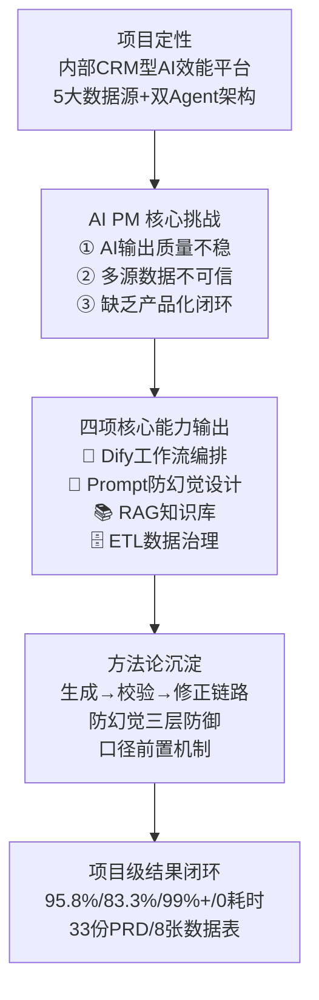

# 05 面试故事地图（CEO大模型 · AI 产品经理视角）

## 1. 主叙事弧（2-3 分钟）

建议讲法：A（15s）→ B（15s）→ C（45s，核心展开）→ D（25s）→ E（20s）。

来源: 2026-02-13 | CEO大模型_项目总览.md | L7-L159

## 2. 分支故事（按面试官兴趣展开）

| 分支 ID | 分支主题 | 展开时机 | 对应 Q&A | AI PM 能力标签 |
|---|---|---|---|---|
| B1 | Agent 架构设计（管家+销售双 Agent） | 追问产品架构 | Q2 | Agent 架构 |
| B2 | Dify 工作流编排（出题生成→校验→修正） | 追问技术选型 | Q3 | 工作流编排 |
| B3 | Prompt 防幻觉设计（熔断+溯源+CoT） | 追问 AI 质量治理 | Q4 | Prompt Engineering |
| B4 | RAG 回访话术（6 大场景+知识库） | 追问 RAG 应用 | Q5 | RAG 知识库 |
| B5 | ETL vs 实时 API 的选型取舍 | 追问数据架构 | Q6 | 数据治理 |
| B6 | 百度渠道口径冲突复盘 | 追问数据可信性 | Q7 | 数据产品 |
| B7 | 估算指标防守策略 | 质疑数据真实性 | Q10 | 证据管理 |

## 3. Hook → Follow-up → Defense 链

| Hook（讲稿钩子） | 预期追问 | 对应 Q&A | AI PM 能力 |
|---|---|---|---|
| 我把产品拆成管家 Agent 和销售 Agent 两大 Agent | 什么是 Agent？为什么这样拆？ | Q2 | Agent 架构 |
| 出题用 Dify 工作流而不是直连 API | Dify 有什么优势？ | Q3 | 工作流编排 |
| 日报出现幻觉，我设计了防幻觉熔断协议 | 什么是熔断？具体怎么做？ | Q4 | Prompt Engineering |
| 回访话术用 RAG + 场景模板动态生成 | RAG 怎么保证质量？ | Q5 | RAG 知识库 |
| 口径冲突我做成了产品能力，先定义再展示 | 口径冲突有什么业务风险？ | Q7 | 数据产品 |
| 估算值我全部做了分层标注 | 数字到底靠谱吗？ | Q10 | 证据管理 |

来源: 2026-02-19 | 01_evidence_ledger.md | C001-C035

## 4. 故事优先级矩阵（时间受限裁剪）

| 时长场景 | 必留 | 可留 | 建议裁剪 |
|---|---|---|---|
| 1 分钟 | A→C→E（定性+核心能力+结果） | B2 或 B3 二选一 | 其他分支 |
| 2 分钟 | A→B→C→D→E（完整主线） | B2+B3（工作流+Prompt） | B4/B5/B6 |
| 3 分钟 | 完整主线 + 2 个分支 | B2+B3+B6（工作流+Prompt+口径） | 按追问展开 |

## 5. 被打断恢复表

| 被打断节点 | 优雅收尾 | 回主线话术 |
|---|---|---|
| 项目定性中（A） | 简单说：这是一个 Agent 架构的 AI 销售效能平台，连接 5 大数据源。 | 我重点讲做了什么 AI 能力。 |
| 核心能力中（C） | 展开太多了，我先讲结论：出题用工作流、日报做防幻觉、回访用 RAG。 | 回到方法论：先可控再放大。 |
| 方法论中（D） | 核心理念一句话：AI 产品先保证数据可信和输出可控，再放大模型能力。 | 回到结果数据。 |
| 结果说明中（E） | 关键数字：考试 95.8%、日报 83.3%、播报 0 耗时。 | 如果你感兴趣，我可以展开某个能力的技术细节。 |

## 6. AI PM 能力关键词速查

面试中主动提及的关键词清单（确保每个词你能展开 30-60 秒）：

| 关键词 | 一句话说明 | 对应分支 |
|---|---|---|
| **Agent 架构** | 按业务角色拆分 Agent，共享数据底座 | B1 |
| **Dify 工作流编排** | 将 AI 能力编排为可控、可校验的多步流程 | B2 |
| **Prompt Engineering** | 防幻觉熔断、溯源锚定、思维链校验 | B3 |
| **RAG 知识库** | 检索增强生成，知识库 + 场景模板 → 个性化话术 | B4 |
| **ETL 数据治理** | 5 源聚合 → 数仓预计算 → Agent 秒级查询 | B5 |
| **数据口径治理** | 先定义口径再展示数据，冲突显式标注 | B6 |
| **BANT-C 分析** | Budget/Authority/Need/Timeline/Competition 销售分析模型 | B2 |
| **生成→校验→修正** | AI 内容质量保障的标准链路 | B2,B3 |

来源: 2026-02-19 | 03_resume_interview_pack.md | A-Action
