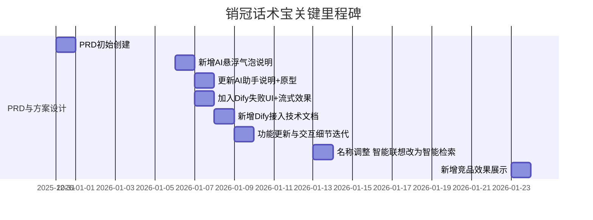
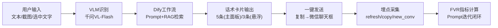
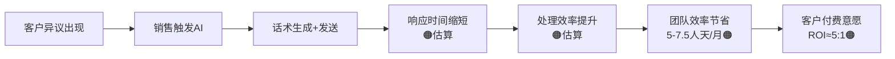
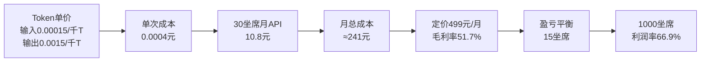

# 02 项目档案 — 销冠话术宝

## 证据标注说明

| 图标 | 含义 | 面试策略 |
|------|------|----------|
| 🟢 | 精确：文档/系统直接可核对 | 安全引用 |
| 🟡 | 推导：由可核对输入推导 | 展示公式 |
| 🟠 | 估算：经验推算（附防线） | 承认估算 |
| 🔴 | 推断：缺直接证据（附边界） | 边界管理 |

---

## 1) 项目背景与时间线

### 1.1 背景摘要

- **产品定位**：面向企业销售团队的输入法内嵌 AI 话术辅助工具（🟢，来源: `v2.01.md | PRD-1.1`）
- **核心价值主张**：通过 AI 语境分析、SOP 话术库检索及快捷辅助工具，帮助销售实现"一键生成高成交率回复"，提升沟通效率与标准化程度（🟢）
- **项目三大目标**：
  1. 降低话术撰写时间 50%+（🟢目标值）
  2. 提升客户异议处理效率 3 倍（🟢目标值）
  3. 实现话术质量标准化覆盖率 90%+（🟢目标值）
- **项目周期**：2025.12 - 2026.02（🟢，PRD修订记录锚定：初始创建2025-12-31，最后更新2026-01-23）
- **项目类型**：To B SaaS，面向医美/教育/金融等行业销售团队
- **项目状态**：已上线，持续迭代中

> **AI PM 视角**：这是一个典型的"AI 能力嵌入已有产品"场景——不是从零构建 AI 工具，而是在成熟输入法产品上叠加大模型能力（VLM+LLM），核心挑战在于**如何让 AI 无感嵌入用户已有工作流**。

### 1.2 关键时间线（基于 PRD 修订记录，🟢精确）

> 备注：修订表中个别条目年份写作"2025-1-xx"，与文档头"最后更新2026年1月23日"并存，按一致性处理为2026年1月事件（🟡推导）。

### 1.3 核心痛点（面试必讲）

| 痛点 | 表现 | 量化影响 | 强度 |
|------|------|----------|------|
| **回复效率低** | 操作路径4+步（切窗→搜索→复制→粘贴） | 30坐席月浪费5-7.5人天（🟠） | 主矛盾 |
| **话术不专业** | 新人缺乏体系化话术，临场发挥 | 标准话术vs即兴回复差距30-50%（🟠行业参考） | 次矛盾 |
| **多模态缺失** | 截图场景无AI辅助 | 处理时间从15-30s延至2-3min（🟠） | 场景缺口 |

---

## 2) 核心功能矩阵

| 模块 | 子功能 | 输入 | 输出 | 优先级 | 状态 | 证据 |
|------|--------|------|------|--------|------|------|
| **AI 主面板** | 文本/截图输入→5条话术卡片 | 文本+最多5张截图 | 5条带标签的话术卡片 | P0 | 已上线 | 🟢 `PRD-4.1` |
| **智能检索** | 候选词上方实时推荐 | 打字关键词 | 最多5条推荐 | P0 | 已上线 | 🟢 `PRD-4.2` |
| **AI 悬浮气泡** | 选中文字→帮我回/润色 | 选中文本 | 3条话术卡片 | P0 | 已上线 | 🟢 `PRD-4.4` |
| **素材库/鼹鼠面板** | 全域搜索+覆盖式搜索层 | 关键词 | 话术/SOP/文件 | P1 | 已上线 | 🟢 `PRD-4.3` |
| **知识库同步** | Dify知识库自动同步 | 企业后台内容变更 | 同步至Dify知识库 | P1 | 方案已定义 | 🟢 `PRD-3.2` |
| **埋点体系** | 3事件+FVR指标 | 用户行为 | 满意度量化 | P0 | 方案已定义 | 🟢 `PRD-7.*` |
| **UI/UX升级** | 全新视觉+动效体系 | — | 灵动光球/骨架屏等 | P0 | 已上线 | 🟢 `PRD-5/6` |

---

## 3) PRD/文档资产清单

| 交付物 | 文档状态 | 个人贡献度 | 类型 | 证据强度 |
|--------|----------|-----------|------|----------|
| `v2.01【202601】.md/pdf` | 正式发布 | **高**（作者署名冯诗楠） | PRD | 🟢 |
| Dify接入技术文档 | PRD内嵌 | **高**（方案设计） | 技术规范 | 🟢 |
| Prototype原型 | 已交付 | **高**（独立设计） | 交互原型 | 🟢 |
| 话术宝问题反馈表 | 持续更新 | **中**（复盘输入） | 问题跟踪 | 🟢 |
| 成本分析模型 | PRD内嵌 | **高**（独立设计） | 商业分析 | 🟢 |
| FVR指标设计 | PRD内嵌 | **高**（独立设计） | 评测体系 | 🟢 |

---

## 4) 功能→PRD→状态追踪链

| 功能 | PRD锚点 | 当前状态 | 数据验证锚点 |
|------|---------|----------|-------------|
| 智能检索（候选词推荐） | `PRD-3.2/4.2` | ✅ 已上线迭代 | 路径压缩4+→1（🟠），触发阈值3字（🟢） |
| AI助手（文本/截图） | `PRD-3.2/4.1` | ✅ 已上线迭代 | 5图上限/5轮对话（🟢），Token实测1715（🟢） |
| AI悬浮气泡 | `PRD-4.4` | ✅ 已上线迭代 | 帮我回/润色手动选择（🟢），异常态UI（🟢） |
| 埋点与FVR | `PRD-7.*` | ✅ 方案已定义 | FVR公式与阈值（🟢），3事件定义（🟢） |
| 成本模型 | `PRD-10.*` | ✅ 可复核 | 0.0003255→0.0004（🟡），毛利率51.7%（🟡） |
| 知识库同步 | `PRD-3.2` | ⏳ 方案已定义 | 重试3次+审计日志（🟢） |

---

## 5) 数据链与业务链

### 5.1 技术数据链

- **关键字段**：`user_id` / `session_id` / `conversation_id`（🟢）
- **一致性约束**：`conversation_id` 对话生命周期内不变（🟢）
- **采集策略**：异步非阻塞 + `sendBeacon` 兜底（🟢）

### 5.2 商业价值链

### 5.3 成本价值链（🟡推导）

---

## 6) 会议/协作索引

| 日期 | 事项 | 结论 | 证据来源 |
|------|------|------|----------|
| 2025-12-31 | PRD初始创建 | 确定产品定位与核心功能范围 | PRD修订记录🟢 |
| 2026-01-06 | 新增AI悬浮气泡 | 确定选中即用交互方案 | PRD修订记录🟢 |
| 2026-01-07 | AI助手说明+Dify异常态 | 明确异常态UI与流式效果 | PRD修订记录🟢 |
| 2026-01-08 | Dify接入技术文档 | 与晨欢/佳裕确认对接规范 | PRD修订记录🟢 |
| 2026-01-13 | 功能命名调整 | 智能联想→智能检索 | PRD修订记录🟢 |
| 2026-01-23 | 竞品效果展示 | 补齐竞品3字触发/距离计算等对照 | PRD修订记录🟢 |

---

## 7) 决策复盘表

| 决策点 | 备选方案 | 最终选择 | 决策理由 | 强度 |
|--------|---------|---------|----------|------|
| AI推荐入口 | A.独立弹窗 / **B.候选词内嵌** | B | 减少操作切换，"零成本嵌入"用户已有工作流 | 🟡 |
| VLM模型选型 | A.GPT-4o-mini / B.豆包视觉 / **C.千问VL-Flash** | C | 输入单价0.00015(最低)，国内节点延迟低，中文截图理解强 | 🟡 |
| 评测方式 | A.满意度问卷 / **B.行为指标FVR** | B | 问卷低响应率，行为数据无需额外操作即可持续采集 | 🟢 |
| 会话策略 | A.无限轮对话 / **B.5轮限制** | B | 无后端持久化场景下控制Token成本与上下文质量 | 🟢 |
| 悬浮气泡意图 | A.自动识别帮我回/润色 / **B.手动选择** | B | 微信无消息方向API，自动识别技术不可行 | 🟢 |
| 输入统一策略 | A.分工作流处理 / **B.统一Dify工作流** | B | 降低维护成本，复用上下文 | 🟡 |

---

## 8) 事故/问题复盘表

| 问题 | 根因 | PM处理策略 | 状态 | 证据 |
|------|------|-----------|------|------|
| 找话术麻烦/触发门槛高 | 检索入口不够贴近输入流 | 设计候选词上方智能检索+覆盖搜索层 | ✅已上线优化 | 🟢反馈表+PRD |
| 语音输入体验差 | 输入能力与稳定性不足 | 进入需求池，部分优先级后排 | ⏳待排期 | 🟢反馈表 |
| Dify调用失败用户困惑 | 技术错误信息直接暴露 | 定义可理解异常态（"网络请求错误"） | ✅已定义 | 🟢PRD |
| 五笔无法输入 | 基础输入能力差异 | 记录为待排期项 | ⏳待排期 | 🟢反馈表 |
| 悬浮气泡自动意图识别失败 | 微信无消息方向API | 改为手动选择，hover变蓝引导 | ✅已解决 | 🟢PRD |
| 对话5轮限制 | 无后端数据库 | 明确为MVP约束，提供新建对话快捷入口 | ✅已解决 | 🟢PRD |

---

## 9) 数据闭环链

| 闭环环节 | 是否闭合 | 说明 |
|----------|---------|------|
| **事件定义→采集规范** | ✅ 闭合 | 3事件+字段+上报方式完整定义（🟢） |
| **采集→指标计算（FVR）** | ✅ 闭合 | 公式+阈值+平滑处理完整（🟢） |
| **指标→Prompt迭代动作** | 🟡 半闭合 | 机制已定义（FVR>2.0触发检查），待线上验证 |
| **迭代→业务结果验证** | 🟠 待闭合 | 效率提升/转化率数据为估算口径 |
| **成本模型→定价验证** | ✅ 闭合 | Token实测→成本推导→定价→毛利率完整链条（🟡） |

---

## 10) 未闭合事项与原因

| 未闭合项 | 状态 | 原因 | 风险 | 面试防线 |
|----------|------|------|------|----------|
| 上线后真实效率分布数据 | 缺失 | 埋点数据积累中 | 中 | 统一表述为"估算口径"，不报"已验证" |
| ROI客户样本 | 缺失 | 缺真实续费/对照样本 | 中 | 先讲成本可复核链，ROI作为推演 |
| 角色边界强证据 | 缺失 | 现有证据以PRD署名为主 | 低 | 只陈述有文档证据的职责 |
| Prompt迭代效果 | 缺失 | FVR指标未在线上跑完完整迭代周期 | 中 | 讲清"闭环机制已建，数据待积累" |

---

## 11) 核心量化口径速查（面试可复述）

| 口径 | 数值 | 强度 | 来源 |
|------|------|------|------|
| 单次调用成本 | **0.0004元**（精确值0.0003255） | 🟡 | Token实测+定价推导 |
| 30坐席月API成本 | **10.80元** | 🟡 | 27,000×0.0004 |
| 月总成本/毛利率/平衡点 | **241元 / 51.7% / 15坐席** | 🟡 | 财务推导 |
| 1000坐席利润率 | **66.9%** | 🟡 | 规模化预测 |
| 操作路径压缩 | **4+步→1步** | 🟠 | 流程拆解 |
| 文本回复耗时 | **15-30s→3-5s** | 🟠 | 动作链估算 |
| 截图处理耗时 | **2-3min→15-30s** | 🟠 | 场景估算 |
| Token实测 | **1715 tokens/5张截图** | 🟢 | API实测返回 |
| FVR公式 | **min((R+1)/(C+1),10)** | 🟢 | PRD定义 |
| 产品定价 | **499元/月/30坐席** | 🟢 | PRD定义 |

> 所有口径来源锚点详见 `01_evidence_ledger.md` 对应 claim_id。
