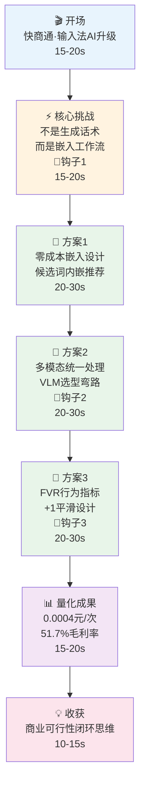

# 05 面试故事地图 — 销冠话术宝

---

## 一、主叙事弧（2-3 min 完整版）

---

## 二、分支故事与展开策略

### 分支 A：成本模型深挖（当面试官对数字感兴趣时）

- **触发信号**：面试官追问"0.0004元怎么算的"
- **展开内容**：Token实测数据→成本公式→月度成本→盈亏平衡→规模化曲线→成本优化策略
- **对应QA**：追问树2（成本模型与商业价值）
- **预计时长**：60-90s
- **关键数字**：0.0003255→0.0004 / 10.8元/月 / 51.7%毛利率 / 15坐席平衡

### 分支 B：FVR指标深挖（当面试官对评测方法感兴趣时）

- **触发信号**：面试官追问"FVR怎么设计的"或"+1是什么"
- **展开内容**：为什么不用问卷→行为数据映射→公式设计→+1平滑逻辑→阈值定义→迭代闭环
- **对应QA**：追问树3（FVR指标设计）
- **预计时长**：60-90s
- **关键点**：拉普拉斯平滑、0.5最优值、2.0触发检查

### 分支 C：交互设计深挖（当面试官对产品设计感兴趣时）

- **触发信号**：面试官追问"零成本嵌入怎么做到的"
- **展开内容**：候选词内嵌vs独立弹窗→3字触发→覆盖式搜索层→悬浮气泡手动选择→异常态设计
- **对应QA**：追问树4（交互设计与用户体验）
- **预计时长**：45-60s
- **关键点**：操作路径压缩4→1、微信API限制、信息聚焦

### 分支 D：VLM选型弯路（当面试官对技术决策感兴趣时）

- **触发信号**：面试官追问"走了什么弯路"
- **展开内容**：GPT-4o-mini→千问VL-Flash的对比→延迟问题→成本差异→最终选型
- **对应QA**：追问树2 L2（为什么选千问）
- **预计时长**：30-45s
- **关键点**：成本差6倍、延迟硬伤、中文理解

---

## 三、钩子→追问→防线链

| 🎣 钩子（脚本中） | 📋 预期追问 | 对应QA | 🛡️ 防线（证据锚点） |
|---|---|---|---|
| "核心挑战不是生成话术而是嵌入工作流" | "怎么做到零成本嵌入的？" | 追问树4 Q1 | 候选词内嵌设计 `C-ARC-003` 🟢 |
| "VLM选型走了一段弯路" | "走了什么弯路？怎么发现的？" | 追问树2 L2 | 三维对比表 `C-MET-017` 🟢 |
| "+1拉普拉斯平滑设计" | "为什么加1？怎么发现这个问题的？" | 追问树3 L2 | FVR公式设计过程 `C-MET-014` 🟢 |

---

## 四、时间优先级矩阵

### 1分钟版本（电梯演讲）

> 我在快商通做了一个输入法内嵌的 AI 销售助手。核心创新是"零成本嵌入"——把 AI 推荐直接嵌入候选词界面，用户打字就能看到推荐，点击就能发送。单次调用成本只要 0.0004 元，产品毛利率 51.7%。我还设计了一个叫 FVR 的行为指标来自动评估 AI 推荐质量。

**保留**：零成本嵌入 + 成本数字 + FVR 一句话
**删掉**：多模态、弯路、详细公式

### 2分钟版本

> 在1分钟版本基础上，加入：
> - 多模态统一处理（文本+截图+选中文字一条工作流）
> - VLM选型决策（千问VL-Flash，成本差6倍）
> - 操作路径压缩数据（4+步→1步）

**保留**：全部核心方案 + 关键数字
**删掉**：弯路故事、+1平滑细节

### 3分钟版本（完整版）

> 完整脚本，包含全部3个钩子。

---

## 五、中断恢复表

| 被打断节点 | 优雅收尾话术 | 引导回主线话术 |
|-----------|------------|-------------|
| 背景介绍中 | "简单来说，就是在输入法里嵌入AI辅助销售回复。" | "这个项目最核心的挑战在于——" |
| 零成本嵌入说明中 | "核心结论就是：把推荐嵌入候选词，操作从4步变1步。" | "除了交互设计，成本控制也是重点——" |
| 多模态方案说明中 | "关键是三种输入统一一条工作流，降低维护成本。" | "选型完成后，我还解决了评测闭环的问题——" |
| VLM选型弯路中 | "最终选了千问VL-Flash，成本只有GPT的六分之一。" | "在指标设计上，我做了一个创新——" |
| FVR指标说明中 | "核心就是用行为数据替代问卷，自动度量AI推荐质量。" | "总结一下成果——" |
| 成本数据展示中 | "一句话：单次0.0004元，毛利率51.7%，15坐席盈亏平衡。" | "最大收获是养成了'每个AI功能都要算清成本'的习惯。" |
| 被追问细节时 | "这个细节我可以展开讲——" | "回到整体来看，这个项目的核心价值是——" |

---

## 六、关键数字速查卡

> 面试前30秒快速浏览

| 数字 | 含义 | 安全等级 |
|------|------|----------|
| **0.0004元** | 单次AI调用成本 | 🟢 可展开推导 |
| **10.8元** | 30坐席月API成本 | 🟢 |
| **51.7%** | 产品毛利率 | 🟢 可展开公式 |
| **15坐席** | 盈亏平衡点 | 🟢 |
| **4+→1步** | 操作路径压缩 | 🟠 需拆解说明 |
| **15-30s→3-5s** | 回复耗时缩短 | 🟠 需说明估算 |
| **1715 tokens** | 5张截图实测 | 🟢 |
| **FVR ≤ 0.5** | 推荐质量优秀阈值 | 🟢 |
| **5条/3条** | 主面板/悬浮气泡话术数 | 🟢 |
| **499元/月** | 产品定价（30坐席） | 🟢 |
